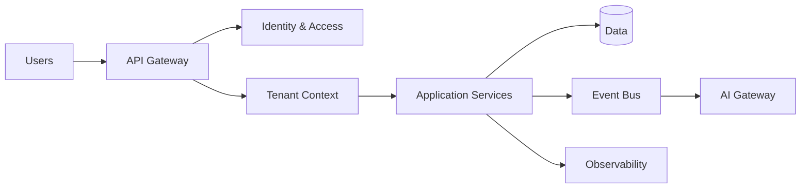

# Architecture Overview

```mermaid
flowchart LR
  U[Users] --> G[API Gateway]
  G --> I[Identity & Access]
  G --> T[Tenant Context]
  T --> S[Application Services]
  S --> D[(Data)]
  S --> E[Event Bus]
  E --> A[AI Gateway]
  S --> O[Observability]
```

This is a public architecture pattern. Production Ceribro implementation
details remain private.
